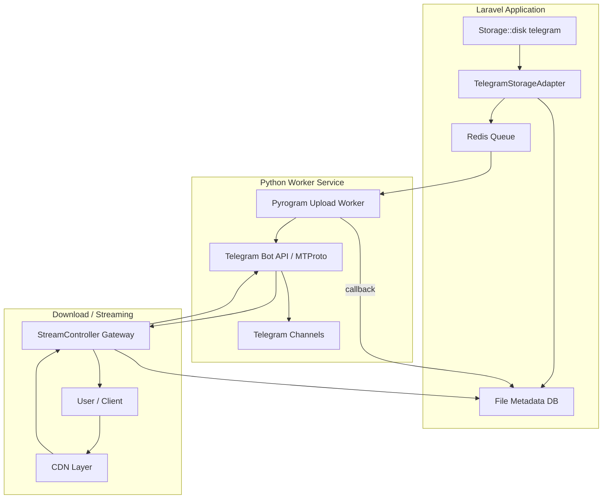
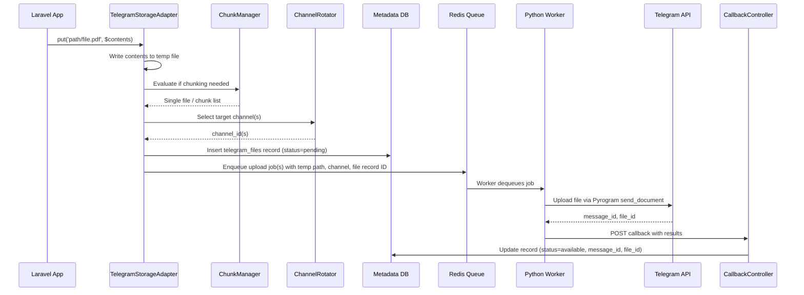
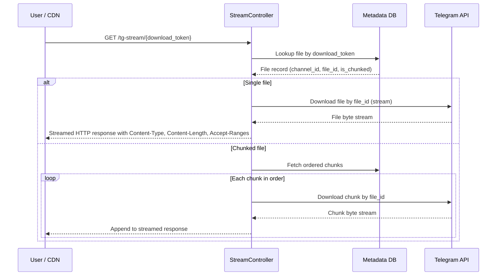

# laravel-telegram-hybrid-storage — Design Document

## 1. Overview

A Laravel 12 package that implements a custom filesystem driver backed by Telegram channels. Files are uploaded asynchronously through a Python worker (Pyrogram) via a Redis queue, and served back through a streaming proxy with optional CDN support. Large files are chunked to respect Telegram's 2 GB file size limit per message, and a channel rotation system distributes storage across multiple Telegram channels.

**Constraints**: PHP 8.4+, Laravel 12, Pyrogram (Python 3.11+), Redis

---

## 2. System Architecture



---

## 3. Component Breakdown

### 3.1 Laravel Package (`laravel-telegram-hybrid-storage`)

| Component | Responsibility |
|---|---|
| `TelegramStorageAdapter` | Implements `League\Flysystem\FilesystemAdapter`. Translates `put`, `get`, `delete`, `url`, `exists`, `size`, `mimeType` calls into metadata DB lookups and queue dispatches. |
| `TelegramStorageServiceProvider` | Registers the `telegram` filesystem driver, publishes config/migrations, binds services. |
| `ChannelRotator` | Selects the next available Telegram channel based on configured rotation strategy (round-robin, least-used, capacity-aware). |
| `ChunkManager` | Splits files exceeding a configurable threshold (default 1.95 GB) into ordered chunks and tracks reassembly metadata. |
| `StreamController` | HTTP controller that proxies file downloads from Telegram to the client as a streamed response, supporting range requests for resumable downloads and video seeking. |
| `UploadJob` (Queueable) | Serializes the upload request (local temp path, target path, metadata) and dispatches it to the Redis queue consumed by the Python worker. |
| `CallbackController` | Receives HTTP callbacks from the Python worker upon upload completion/failure, updates file metadata with Telegram message IDs and status. |

### 3.2 Python Worker Service

| Component | Responsibility |
|---|---|
| `worker.py` | Main process — connects to Redis, listens on the upload queue, manages the session pool, spawns upload tasks. |
| `uploader.py` | Uses Pyrogram client to upload a file (or chunk) to the designated Telegram channel. Returns `message_id` and `file_id` on success. |
| `session_pool.py` | Manages multiple Pyrogram sessions, handles session selection strategy, tracks per-session rate limits and busy state. |
| `callback.py` | POSTs upload results (success/failure, `message_id`, `file_id`, `file_unique_id`, chunk index, checksum) back to the Laravel `CallbackController`. |
| `config.py` | Reads environment variables for Redis connection, Telegram API credentials, session pool config, Laravel callback URL, concurrency limits. |

### 3.3 Shared Infrastructure

| Component | Technology | Purpose |
|---|---|---|
| Redis Queue | Redis (list-based or Streams) | Decouples Laravel upload requests from Python worker processing. |
| Metadata Database | MySQL / PostgreSQL / SQLite | Stores file records, chunk mappings, channel assignments, download tokens. |
| CDN (optional) | Cloudflare / Nginx / Any reverse proxy | Caches streamed responses at edge; origin is the Laravel `StreamController`. |

---

## 4. Data Model

### 4.1 `telegram_files` Table

| Column | Type | Description |
|---|---|---|
| id | ULID (PK) | Unique file identifier |
| disk_path | string (indexed, unique) | Virtual path used by Laravel Storage (e.g., `uploads/photo.jpg`) |
| original_name | string, nullable | Original filename |
| mime_type | string, nullable | Detected MIME type |
| size | unsigned bigint | Total file size in bytes |
| checksum | string(64), nullable | SHA-256 hex digest of the entire file |
| status | enum: `pending`, `uploading`, `available`, `failed` | Current lifecycle state |
| channel_id | string | Telegram channel ID where the file (or first chunk) is stored |
| message_id | unsigned bigint, nullable | Telegram message ID (null until upload completes) |
| file_id | string, nullable | Telegram file_id (null until upload completes) |
| file_unique_id | string, nullable | Telegram file_unique_id |
| is_chunked | boolean, default false | Whether the file was split into chunks |
| chunk_count | unsigned int, default 1 | Total number of chunks |
| download_token | string (indexed, unique) | Token used in permanent download URLs |
| metadata | JSON, nullable | Arbitrary key-value metadata |
| created_at | timestamp | |
| updated_at | timestamp | |

### 4.2 `telegram_file_chunks` Table

| Column | Type | Description |
|---|---|---|
| id | ULID (PK) | |
| file_id | ULID (FK → telegram_files) | Parent file |
| chunk_index | unsigned int | 0-based order |
| channel_id | string | Channel this chunk was uploaded to |
| session_name | string, nullable | Pyrogram session that uploaded this chunk |
| message_id | unsigned bigint, nullable | |
| file_id_tg | string, nullable | Telegram file_id for this chunk |
| size | unsigned bigint | Chunk size in bytes |
| checksum | string(64), nullable | SHA-256 hex digest of the chunk content |
| is_compressed | boolean, default false | Whether gzip compression was applied |
| encryption_iv | string, nullable | AES-256-GCM IV/nonce (base64), null if not encrypted |
| status | enum: `pending`, `uploading`, `available`, `failed` | |
| attempts | unsigned int, default 0 | Number of upload attempts |
| last_error | text, nullable | Last failure reason |
| created_at | timestamp | |

### 4.3 `telegram_channels` Table

| Column | Type | Description |
|---|---|---|
| id | unsigned int (PK) | |
| channel_identifier | string (unique) | Telegram channel username or numeric ID |
| label | string, nullable | Human-readable label |
| is_active | boolean, default true | Whether this channel is available for new uploads |
| priority | unsigned int, default 0 | Used by rotation strategy |
| total_files | unsigned bigint, default 0 | Counter cache |
| total_bytes | unsigned bigint, default 0 | Counter cache |
| created_at | timestamp | |
| updated_at | timestamp | |

---

## 5. Configuration

The package publishes a single config file `config/telegram-storage.php`.

| Key | Type | Description |
|---|---|---|
| `channels` | array | List of Telegram channel IDs/usernames for storage |
| `rotation_strategy` | string | `round-robin` / `least-used` / `capacity-aware` |
| `chunk_threshold` | int (bytes) | File size above which chunking activates (default: 1.95 GB) |
| `chunk_size` | int (bytes) | Size of each chunk (default: 1.95 GB, auto-adjusts for premium) |
| `chunk_compression` | boolean | Enable gzip compression per chunk (default: false) |
| `chunk_encryption` | boolean | Enable AES-256-GCM encryption per chunk (default: false) |
| `chunk_encryption_key` | string, nullable | Master encryption key (reads from env) |
| `chunk_verify` | boolean | Verify checksums after upload (default: true) |
| `upload_stall_timeout` | int (minutes) | Time before a stalled upload is auto-retried (default: 30) |
| `redis.connection` | string | Redis connection name from `database.php` |
| `redis.queue_key` | string | Redis key for the upload queue |
| `worker_callback_url` | string | URL the Python worker calls back to report upload results |
| `worker_callback_secret` | string | Shared HMAC secret to authenticate callbacks |
| `download.route_prefix` | string | URL prefix for streaming endpoints (default: `/tg-stream`) |
| `download.middleware` | array | Middleware applied to streaming routes |
| `download.signed_urls` | boolean | Whether download URLs are signed with expiration |
| `download.url_ttl` | int (seconds) | Signed URL time-to-live (default: 3600) |
| `cdn.enabled` | boolean | Whether to prepend a CDN base URL |
| `cdn.base_url` | string | CDN origin URL |
| `pyrogram.api_id` | int | Telegram API ID |
| `pyrogram.api_hash` | string | Telegram API Hash |
| `pyrogram.session_name` | string | Pyrogram session name |
| `pyrogram.bot_token` | string, nullable | Optional bot token (alternative to user session) |
| `pyrogram.concurrency` | int | Max concurrent uploads in the worker (default: 3) |
| `pyrogram.sessions` | array | List of session configs for multi-account pooling. Each entry: `{api_id, api_hash, session_name, bot_token?, is_premium?}` |
| `pyrogram.session_strategy` | string | Session selection: `round-robin` / `least-busy` (default: `round-robin`) |

---

## 6. Core Workflows

### 6.1 Upload Flow (`Storage::disk('telegram')->put()`)



### 6.2 Download / Streaming Flow (`Storage::disk('telegram')->get()` and URL access)



### 6.3 URL Generation (`Storage::disk('telegram')->url()`)

1. Adapter looks up `telegram_files` by `disk_path`.
2. If `signed_urls` is enabled, generates a signed URL with expiration using Laravel's URL signer: `{route_prefix}/{download_token}?signature=...&expires=...`
3. If CDN is enabled, prepends `cdn.base_url` to the path.
4. Returns the permanent (or signed) URL.

---

## 7. Channel Rotation System

The `ChannelRotator` service selects a target channel for each upload based on the configured strategy:

| Strategy | Selection Logic |
|---|---|
| `round-robin` | Cycles through active channels sequentially, tracked via an atomic Redis counter. |
| `least-used` | Selects the active channel with the lowest `total_files` count. |
| `capacity-aware` | Selects the active channel with the lowest `total_bytes`. Useful when channel storage should be balanced by size. |

Channels can be marked inactive at runtime to stop new uploads without affecting existing file retrieval.

---

## 8. File Size Limit Bypass and Chunking Strategy

### 8.1 Telegram Upload Limits

| Access Method | Upload Limit | Download Limit | Notes |
|---|---|---|---|
| Bot API (standard) | 50 MB | 20 MB | Severely restricted |
| Bot API (local server) | 2 GB | 2 GB | Requires self-hosted bot API server |
| MTProto via Pyrogram (regular) | 2 GB | 2 GB | User account session |
| MTProto via Pyrogram (premium) | 4 GB | 4 GB | Telegram Premium account |

The package bypasses all of these limits through intelligent chunking combined with multi-account pooling, enabling **unlimited effective file sizes**.

### 8.2 Adaptive Chunk Sizing

- The `ChunkManager` auto-detects the effective limit per Telegram session based on account type (regular vs premium).
- Default chunk sizes: 1.95 GB for regular accounts, 3.9 GB for premium accounts (with safety margin).
- Configurable override via `chunk_size` in config.
- Files below the detected limit are uploaded as a single message (no chunking overhead).

### 8.3 Unlimited File Size via Chunking

- Files of any size are accepted. The `ChunkManager` splits them into ordered parts, each within the per-account upload limit.
- Each chunk is uploaded as a separate Telegram message.
- The `telegram_file_chunks` table maintains ordering via `chunk_index`.
- On download, the `StreamController` streams chunks sequentially, presenting a single contiguous file to the client.

### 8.4 Parallel Chunk Uploads

- Chunks of a single file can be uploaded concurrently across multiple worker threads/processes.
- The Python worker maintains a configurable concurrency pool (default: 3 concurrent uploads).
- Chunks can be distributed across different channels to parallelize further and avoid per-channel rate limits.
- Upload order does not need to match chunk order — reassembly uses `chunk_index`.

### 8.5 Multi-Account Session Pooling

To multiply throughput and bypass per-account rate limits:

| Concept | Description |
|---|---|
| Session Pool | Multiple Pyrogram sessions (user accounts or bots) registered in the worker config. |
| Session Selector | Assigns upload jobs to sessions using round-robin or least-busy selection. |
| Rate Limit Isolation | Each session has independent Telegram rate limits, so N sessions = N x throughput. |
| Mixed Account Types | Pool can contain both regular (2 GB limit) and premium (4 GB limit) accounts. ChunkManager adapts chunk size per assigned session. |

Sessions are configured as an array in the worker config, each with its own `api_id`, `api_hash`, and `session_name`.

### 8.6 Integrity Verification

- Each chunk receives a SHA-256 checksum computed before upload.
- After upload, the Python worker re-downloads a small verification sample (first + last 1 MB) and validates against the checksum.
- The whole-file SHA-256 is computed during chunking and stored on the `telegram_files` record.
- On download/reassembly, the `StreamController` can optionally verify chunk checksums (configurable, off by default for streaming performance).

### 8.7 Resumable Uploads

- If a multi-chunk upload is interrupted (worker crash, network failure), only the chunks with status `pending` or `failed` are re-enqueued on retry.
- Already-uploaded chunks (status `available`) are skipped entirely.
- The file stays in `uploading` status until all chunks reach `available`.
- A periodic health-check job in Laravel detects stalled uploads (no progress within a configurable timeout) and re-enqueues them.

### 8.8 Optional Chunk Compression

- When enabled, each chunk is compressed (gzip level configurable) before upload, reducing storage usage and upload time.
- A `is_compressed` flag on each chunk record signals the `StreamController` to decompress on the fly during download.
- Compression is skipped for already-compressed MIME types (images, video, archives) to avoid wasting CPU.

### 8.9 Optional Chunk Encryption

- When enabled, each chunk is encrypted with AES-256-GCM before upload.
- The encryption key is derived from a master key stored in the Laravel application's environment.
- Each chunk gets a unique IV/nonce stored alongside the chunk record.
- Decryption happens transparently in the `StreamController` during streaming.
- This ensures data privacy even if the Telegram channel is compromised.

If any chunk upload fails, a retry mechanism re-enqueues only the failed chunks.

---

## 9. Redis Queue Contract

The Laravel side enqueues JSON payloads to the configured Redis key. The Python worker consumes from the same key.

**Queue message structure** (conceptual):

| Field | Type | Description |
|---|---|---|
| `job_id` | string | Unique job identifier |
| `file_record_id` | string | ULID of the `telegram_files` row |
| `chunk_index` | int or null | Null for single-file uploads |
| `temp_path` | string | Absolute path to the temp file / chunk on the shared filesystem |
| `channel_id` | string | Target Telegram channel |
| `callback_url` | string | Full callback URL |
| `hmac_secret` | string | Shared secret for callback authentication |

The Python worker acknowledges the job only after a successful callback POST is confirmed.

---

## 10. Streaming Proxy and CDN

### StreamController Behavior

- Validates `download_token` (and signature if signed URLs are enabled).
- Sets response headers: `Content-Type`, `Content-Length`, `Content-Disposition`, `Accept-Ranges`.
- Supports HTTP `Range` requests for partial content (video seeking, resume).
- Streams bytes directly from Telegram to the client without writing to local disk.
- Returns `404` if the file record does not exist or status is not `available`.
- Returns `410 Gone` if the file has been explicitly deleted.

### CDN Integration

- The CDN sits in front of the `StreamController` as a reverse proxy.
- Cache key is the `download_token` (immutable per file).
- Cache-Control headers are set by the `StreamController` to allow CDN caching (e.g., `public, max-age=86400`).
- Cache invalidation on file deletion is handled by purging the CDN key via the CDN provider's API (configurable purge driver).

---

## 11. Security

| Concern | Approach |
|---|---|
| Callback authentication | Python worker signs callback payloads with HMAC-SHA256 using the shared secret. `CallbackController` verifies before processing. |
| Download URL protection | Optional signed URLs with expiration. Middleware stack is configurable per deployment. |
| Telegram credentials | Stored in `.env`, never committed. Config references `env()` helpers. |
| Temp file cleanup | Temp files are deleted after the Python worker confirms upload or after a configurable TTL. |
| Rate limiting | `StreamController` routes can be wrapped with Laravel's `throttle` middleware. |

---

## 12. Package Directory Structure

```
laravel-telegram-hybrid-storage/
  src/
    TelegramStorageServiceProvider        — Service provider, driver registration, route registration
    TelegramStorageAdapter                — Flysystem adapter implementation
    ChannelRotator                        — Channel selection service
    ChunkManager                          — File splitting, reassembly, compression, encryption logic
    IntegrityVerifier                     — SHA-256 checksum computation and verification
    Jobs/
      UploadToTelegramJob                 — Queueable job that enqueues to Redis for the Python worker
    Http/
      Controllers/
        StreamController                  — Streaming proxy endpoint
        CallbackController                — Receives upload results from Python worker
      Middleware/
        VerifyCallbackSignature           — HMAC verification for worker callbacks
        VerifyDownloadSignature           — Signed URL verification for downloads
    Models/
      TelegramFile                        — Eloquent model for telegram_files
      TelegramFileChunk                   — Eloquent model for telegram_file_chunks
      TelegramChannel                     — Eloquent model for telegram_channels
    Facades/
      TelegramStorage                     — Optional facade for direct access beyond Storage API
  config/
    telegram-storage.php                  — Published configuration file
  database/
    migrations/
      create_telegram_files_table         — Schema for telegram_files
      create_telegram_file_chunks_table   — Schema for telegram_file_chunks
      create_telegram_channels_table      — Schema for telegram_channels
  routes/
    telegram-storage.php                  — Stream and callback route definitions
  python-worker/
    worker.py                             — Main entry point, Redis consumer loop
    uploader.py                           — Pyrogram upload logic
    callback.py                           — HTTP callback to Laravel
    config.py                             — Environment-based configuration
    requirements.txt                      — Python dependencies (pyrogram, redis, httpx)
    Dockerfile                            — Containerized deployment for the worker
  docs/
    README.md                             — Installation, configuration, usage guide
  tests/
    Feature/
      UploadFlowTest                      — End-to-end upload pipeline test
      StreamControllerTest                — Download/streaming test
      ChannelRotatorTest                  — Rotation strategy tests
    Unit/
      ChunkManagerTest                    — Chunking logic tests
      TelegramStorageAdapterTest          — Adapter method tests
```

---

## 13. Integration Points

### Laravel Filesystem Registration

The service provider registers a custom driver with `Storage::extend('telegram', ...)` which instantiates the `TelegramStorageAdapter` wrapped in a `League\Flysystem\Filesystem` instance. This enables the standard API:

| Laravel Call | Adapter Behavior |
|---|---|
| `Storage::disk('telegram')->put($path, $data)` | Writes temp file, creates DB record, dispatches upload job |
| `Storage::disk('telegram')->get($path)` | Looks up file record, downloads from Telegram via Pyrogram bot API (synchronous HTTP), returns contents |
| `Storage::disk('telegram')->url($path)` | Returns permanent/signed streaming URL |
| `Storage::disk('telegram')->exists($path)` | Checks `telegram_files` for a record with status `available` |
| `Storage::disk('telegram')->delete($path)` | Marks record as deleted, optionally deletes Telegram message |
| `Storage::disk('telegram')->size($path)` | Returns `size` from DB record |
| `Storage::disk('telegram')->mimeType($path)` | Returns `mime_type` from DB record |

### `filesystems.php` Disk Entry

The user adds a `telegram` disk to `config/filesystems.php` referencing the driver name `telegram` and any disk-level overrides.

---

## 14. Failure Handling and Retry

| Failure Scenario | Handling |
|---|---|
| Python worker crashes mid-upload | Job remains in Redis (no ACK). Worker restart re-processes it. File status stays `pending`/`uploading`. |
| Telegram API rate limit | Worker implements exponential backoff with jitter. Configurable max retries. |
| Callback POST fails | Worker retries the callback with exponential backoff. After max retries, logs the failure for manual recovery. |
| Chunk upload partial failure | Only failed chunks are re-enqueued. File remains in `uploading` state until all chunks succeed. |
| Temp file missing | Worker marks job as failed, callback sets file status to `failed`. Laravel can emit an event for application-level handling. |

---

## 15. Events

The package dispatches Laravel events at key lifecycle points:

| Event | Payload | Triggered When |
|---|---|---|
| `TelegramUploadQueued` | file record ID, path | File upload job dispatched to Redis |
| `TelegramUploadCompleted` | file record ID, path, file_id | Callback confirms successful upload |
| `TelegramUploadFailed` | file record ID, path, error | Callback reports failure after all retries |
| `TelegramChunkCompleted` | file record ID, chunk index, file_id | Individual chunk upload confirmed |
| `TelegramChunkFailed` | file record ID, chunk index, error | Individual chunk upload failed |
| `TelegramUploadStalled` | file record ID, path, stall duration | Upload detected as stalled, auto-retry triggered |
| `TelegramFileDeleted` | file record ID, path | File record deleted |
