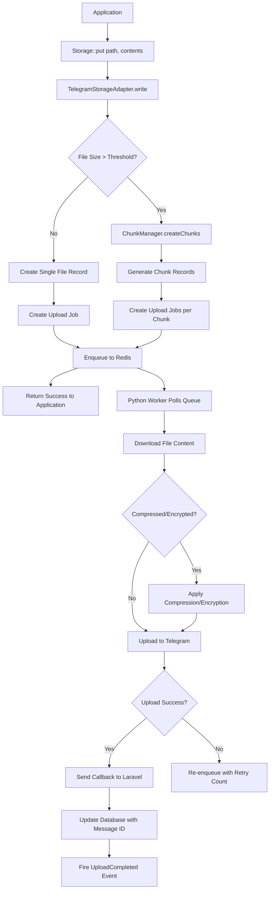
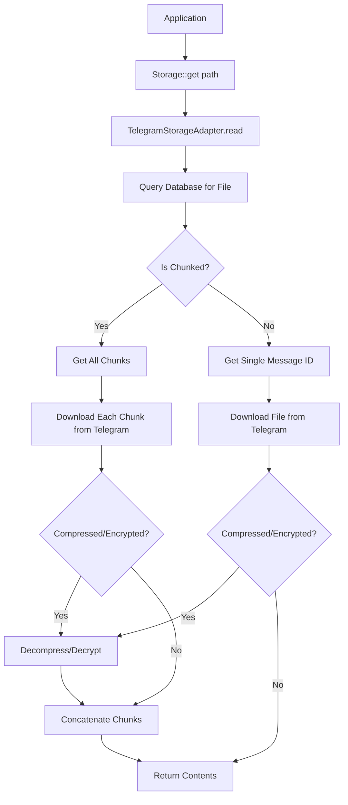
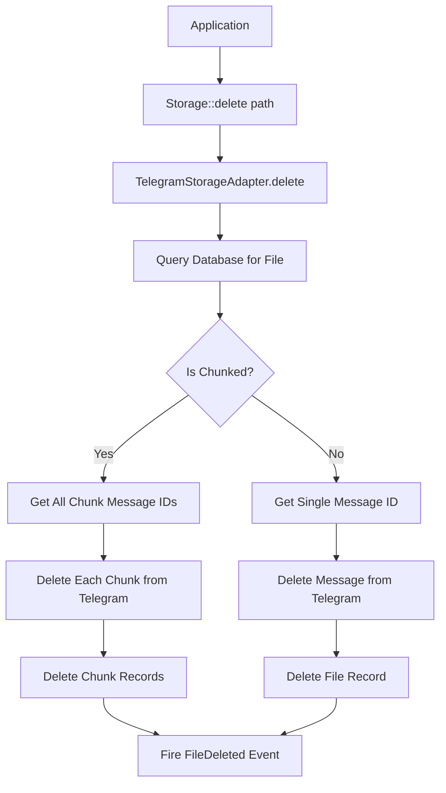

# Architecture Design Documentation

## Table of Contents

1. [System Overview](#system-overview)
2. [Architecture Patterns](#architecture-patterns)
3. [Component Architecture](#component-architecture)
4. [Data Flow](#data-flow)
5. [Integration Points](#integration-points)
6. [Security Architecture](#security-architecture)
7. [Scalability Considerations](#scalability-considerations)

---

## System Overview

### High-Level Architecture

The Laravel Telegram Hybrid Storage system implements a **hybrid cloud storage solution** that leverages Telegram channels as a distributed storage backend. The architecture follows a **service-oriented design** with clear separation between the PHP/Laravel application layer and the Python worker layer.

```
┌─────────────────────────────────────────────────────────────────┐
│                         Client Application                       │
│                    (Laravel 12 Application)                      │
└─────────────────────────────────────────────────────────────────┘
                                │
                                ▼
┌─────────────────────────────────────────────────────────────────┐
│                    Laravel Storage Layer                         │
│              (Storage Facade + FilesystemAdapter)                │
└─────────────────────────────────────────────────────────────────┘
                                │
                                ▼
┌─────────────────────────────────────────────────────────────────┐
│                  Telegram Storage Adapter                        │
│  ┌──────────────┬──────────────┬──────────────┬──────────────┐ │
│  │   Channel    │    Chunk     │  Integrity   │    Event     │ │
│  │   Rotator    │   Manager    │  Verifier    │   Dispatcher │ │
│  └──────────────┴──────────────┴──────────────┴──────────────┘ │
└─────────────────────────────────────────────────────────────────┘
                                │
                                ▼
┌─────────────────────────────────────────────────────────────────┐
│                      Redis Message Queue                         │
│                 (Upload Job Queue + Callbacks)                   │
└─────────────────────────────────────────────────────────────────┘
                                │
                                ▼
┌─────────────────────────────────────────────────────────────────┐
│                     Python Worker Layer                          │
│  ┌──────────────────────────────────────────────────────────┐   │
│  │  Session Pool Manager (Multi-Account Pyrogram Sessions)  │   │
│  └──────────────────────────────────────────────────────────┘   │
│  ┌──────────────────────────────────────────────────────────┐   │
│  │        Upload Processor (Chunked Upload Handler)         │   │
│  └──────────────────────────────────────────────────────────┘   │
└─────────────────────────────────────────────────────────────────┘
                                │
                                ▼
┌─────────────────────────────────────────────────────────────────┐
│                    Telegram Channels (MTProto)                   │
│           ┌──────────┬──────────┬──────────┬──────────┐         │
│           │ Channel 1│ Channel 2│ Channel 3│ Channel N│         │
│           └──────────┴──────────┴──────────┴──────────┘         │
└─────────────────────────────────────────────────────────────────┘
```

---

## Architecture Patterns

### 1. **Adapter Pattern**

The `TelegramStorageAdapter` implements Flysystem's `FilesystemAdapter` interface, allowing seamless integration with Laravel's filesystem abstraction.

**Benefits:**
- Transparent replacement of storage backends
- Consistent API across different storage systems
- Easy testing and mocking

**Implementation:**
```php
class TelegramStorageAdapter implements FilesystemAdapter
{
    public function write($path, $contents, Config $config): void
    {
        // Delegates to internal components
    }
    
    public function read($path): string
    {
        // Retrieves from Telegram via streaming
    }
}
```

### 2. **Queue-Based Processing**

Asynchronous upload processing through Redis message queue.

**Flow:**
1. Application writes file → Metadata created in database
2. Upload job enqueued to Redis → Immediate return to application
3. Python worker polls queue → Processes upload asynchronously
4. Callback sent to Laravel → Database updated with Telegram message IDs

**Benefits:**
- Non-blocking operations
- Improved application responsiveness
- Retry logic and error handling
- Load leveling

### 3. **Strategy Pattern (Channel Rotation)**

Multiple channel selection strategies implemented through the Strategy pattern.

**Strategies:**
- **Round-Robin**: Distributes uploads evenly across channels
- **Least-Used**: Selects channel with fewest files
- **Capacity-Aware**: Considers channel storage capacity

```php
interface RotationStrategy
{
    public function select(array $channels): TelegramChannel;
}

class RoundRobinStrategy implements RotationStrategy
{
    public function select(array $channels): TelegramChannel
    {
        // Implementation
    }
}
```

### 4. **Chain of Responsibility (Chunking Pipeline)**

File processing through a chain of handlers:

```
File → Size Check → Chunk Creation → Compression → Encryption → Upload
```

Each handler can modify or pass-through the data.

### 5. **Observer Pattern (Event System)**

Laravel events broadcast system state changes:

- `TelegramUploadQueued`
- `TelegramUploadCompleted`
- `TelegramUploadFailed`
- `TelegramChunkCompleted`
- `TelegramChunkFailed`

---

## Component Architecture

### Core Components

#### 1. **TelegramStorageAdapter**

**Responsibility:** Bridge between Laravel Storage facade and Telegram backend

**Dependencies:**
- `ChannelRotator` - Channel selection
- `ChunkManager` - File chunking logic
- `IntegrityVerifier` - Checksum verification

**Methods:**
- `write()` / `writeStream()` - File upload
- `read()` / `readStream()` - File download
- `delete()` - File removal
- `fileExists()` - Existence check
- `getSize()` / `getMimeType()` - Metadata retrieval
- `getUrl()` - URL generation (signed/unsigned)

#### 2. **ChannelRotator**

**Responsibility:** Optimal channel selection for each upload

**State Management:**
- Tracks channel usage counts
- Monitors channel health
- Maintains rotation state in cache

**Algorithms:**
```php
// Round-Robin
$index = ($lastIndex + 1) % count($channels);

// Least-Used
SELECT * FROM channels ORDER BY file_count ASC LIMIT 1;

// Capacity-Aware
SELECT * FROM channels WHERE used_capacity < max_capacity 
ORDER BY (used_capacity / max_capacity) ASC;
```

#### 3. **ChunkManager**

**Responsibility:** Split large files into chunks and reassemble on download

**Chunk Structure:**
```
File ID | Chunk Index | Total Chunks | Data | Checksum | IV (if encrypted)
```

**Process:**
1. Calculate number of chunks: `ceil(fileSize / chunkSize)`
2. Create chunk records in database
3. Generate individual upload jobs per chunk
4. Track completion status
5. Reassemble by concatenating chunks in order

**Compression:**
```python
import gzip
compressed = gzip.compress(chunk_data)
```

**Encryption:**
```python
from cryptography.hazmat.primitives.ciphers.aead import AESGCM
aesgcm = AESGCM(key)
nonce = os.urandom(12)
ciphertext = aesgcm.encrypt(nonce, chunk_data, None)
```

#### 4. **IntegrityVerifier**

**Responsibility:** Ensure data integrity through checksums

**Checksum Types:**
- **SHA-256**: Cryptographic hash for integrity verification
- **CRC32**: Fast error detection for transmission

**Verification Points:**
1. Pre-upload checksum generation
2. Post-download verification
3. Chunk-level integrity checks
4. Periodic integrity audits

```php
public function generateChecksum($data): string
{
    return hash('sha256', $data);
}

public function verifyChecksum($data, $expectedChecksum): bool
{
    return hash('sha256', $data) === $expectedChecksum;
}
```

#### 5. **Python Worker Components**

**SessionPool:**
- Manages multiple Pyrogram client sessions
- Implements connection pooling
- Handles session lifecycle (create, refresh, destroy)
- Rate limiting per session

**Uploader:**
- Polls Redis queue for upload jobs
- Downloads file content from Laravel storage
- Uploads to Telegram via MTProto
- Sends callback to Laravel on completion

```python
async def upload_file(job):
    async with session_pool.get_session() as client:
        message = await client.send_file(
            chat_id=job.channel_id,
            file=job.file_path,
            caption=job.caption
        )
        await send_callback(message.id, job.callback_url)
```

---

## Data Flow

### Upload Workflow



### Download Workflow



### Delete Workflow



---

## Integration Points

### 1. **Laravel Storage Facade**

**Integration:** Extends Laravel's filesystem through custom driver registration

```php
// In TelegramStorageServiceProvider::boot()
Storage::extend('telegram', function ($app, $config) {
    $adapter = $app->make(TelegramStorageAdapter::class);
    $filesystem = new Filesystem($adapter, $config);
    return new FilesystemAdapter($filesystem, $adapter, $config);
});
```

**Usage:**
```php
Storage::disk('telegram')->put('file.txt', 'contents');
```

### 2. **Redis Queue**

**Integration:** Uses Laravel's Redis connection for job queue

**Queue Structure:**
```json
{
  "job_id": "uuid",
  "file_id": 123,
  "path": "documents/file.pdf",
  "channel_id": -1001234567890,
  "chunk_index": null,
  "retry_count": 0,
  "callback_url": "https://app.com/callback"
}
```

### 3. **Database (Eloquent ORM)**

**Models:**
- `TelegramChannel` - Channel metadata
- `TelegramFile` - File metadata
- `TelegramFileChunk` - Chunk metadata

**Schema:**
```sql
-- telegram_channels
id | channel_id | username | capacity | used_capacity | is_active

-- telegram_files
id | path | size | mime_type | total_chunks | checksum | message_ids

-- telegram_file_chunks
id | file_id | chunk_index | message_id | size | checksum | iv
```

### 4. **Python Pyrogram Library**

**Integration:** MTProto client for Telegram API interaction

**Session Management:**
```python
from pyrogram import Client

class SessionPool:
    def __init__(self, sessions_config):
        self.sessions = []
        for config in sessions_config:
            client = Client(
                name=config['session_name'],
                api_id=config['api_id'],
                api_hash=config['api_hash'],
                bot_token=config['bot_token']
            )
            self.sessions.append(client)
    
    async def get_session(self):
        # Return available session
```

### 5. **HTTP Callback Endpoint**

**Integration:** RESTful endpoint for worker callbacks

**Route:**
```php
Route::post('/telegram-storage/callback', [CallbackController::class, 'handle'])
    ->middleware(VerifyCallbackSignature::class);
```

**Payload:**
```json
{
  "job_id": "uuid",
  "file_id": 123,
  "message_id": 456,
  "status": "success",
  "error": null
}
```

---

## Security Architecture

### 1. **Authentication & Authorization**

**Worker Callback Authentication:**
- HMAC-SHA256 signature verification
- Secret key shared between Laravel and worker
- Timestamp-based replay attack prevention

```php
class VerifyCallbackSignature extends Middleware
{
    public function handle($request, Closure $next)
    {
        $signature = $request->header('X-Signature');
        $payload = $request->getContent();
        $expected = hash_hmac('sha256', $payload, config('telegram-storage.callback_secret'));
        
        if (!hash_equals($signature, $expected)) {
            abort(403, 'Invalid signature');
        }
        
        return $next($request);
    }
}
```

### 2. **Data Encryption**

**At Rest (Optional):**
- AES-256-GCM encryption per chunk
- Unique initialization vector (IV) per chunk
- Encryption keys stored in environment variables

```php
$key = random_bytes(32); // 256-bit key
$nonce = random_bytes(12); // 96-bit nonce for GCM
$ciphertext = openssl_encrypt(
    $data,
    'aes-256-gcm',
    $key,
    OPENSSL_RAW_DATA,
    $nonce,
    $tag
);
```

### 3. **Integrity Verification**

**Checksums:**
- SHA-256 hash for each chunk
- File-level checksum for end-to-end verification
- Automatic integrity validation on download

### 4. **Access Control**

**Signed URLs (Optional):**
- Time-limited download URLs
- HMAC-signed URL parameters
- Configurable TTL

```php
public function generateSignedUrl($path, $ttl = 3600): string
{
    $expiration = time() + $ttl;
    $signature = hash_hmac('sha256', "{$path}:{$expiration}", $this->urlSecret);
    return url("/storage/{$path}?expires={$expiration}&signature={$signature}");
}
```

### 5. **Rate Limiting**

**Protection:**
- Per-session rate limits in Python worker
- Telegram API rate limit compliance
- Exponential backoff on failures

---

## Scalability Considerations

### 1. **Horizontal Scaling**

**Multiple Workers:**
- Deploy multiple Python worker instances
- Redis queue distributes jobs across workers
- No coordination required between workers

**Load Balancing:**
- Session pool distributes uploads across sessions
- Multiple bot accounts for increased throughput
- Independent scaling of Laravel app and workers

### 2. **Vertical Scaling**

**Resource Allocation:**
- Increase worker memory for larger chunk sizes
- More CPU cores for parallel compression/encryption
- Faster network for improved upload speeds

### 3. **Database Optimization**

**Indexing:**
```sql
CREATE INDEX idx_file_path ON telegram_files(path);
CREATE INDEX idx_chunk_file_id ON telegram_file_chunks(file_id, chunk_index);
CREATE INDEX idx_channel_active ON telegram_channels(is_active);
```

**Partitioning:**
- Partition `telegram_file_chunks` by `file_id` range
- Archive old file records to separate tables

### 4. **Caching Strategy**

**Redis Cache:**
- Channel rotation state
- File metadata (path → file_id mapping)
- Session availability status

**Cache Invalidation:**
- TTL-based expiration
- Event-driven cache clearing
- Write-through caching for reads

### 5. **Performance Optimizations**

**Parallel Uploads:**
```python
# Upload chunks in parallel
async def upload_chunks(chunks):
    tasks = [upload_chunk(chunk) for chunk in chunks]
    await asyncio.gather(*tasks)
```

**Streaming:**
- Stream file downloads directly from Telegram
- Avoid loading entire file into memory
- Chunked transfer encoding for HTTP responses

**Connection Pooling:**
- Reuse Pyrogram sessions across uploads
- Persistent database connections
- HTTP keep-alive for callbacks

### 6. **Monitoring & Observability**

**Metrics to Track:**
- Queue depth (pending jobs)
- Upload success/failure rates
- Average upload time per file
- Channel utilization
- Worker health status

**Logging:**
- Structured JSON logging
- Correlation IDs for tracing
- Log aggregation (ELK stack, Splunk)

**Alerting:**
- High queue depth threshold
- Elevated failure rates
- Worker downtime
- Channel capacity warnings

---

## Conclusion

This architecture provides a robust, scalable solution for unlimited file storage using Telegram as a backend. The modular design allows for easy extension, testing, and maintenance while maintaining high performance and reliability.

Key strengths:
- **Decoupled components** through adapter and queue patterns
- **Asynchronous processing** for non-blocking operations
- **Horizontal scalability** through stateless workers
- **Data integrity** through checksums and verification
- **Security** through encryption and authentication
- **Flexibility** through configurable strategies
