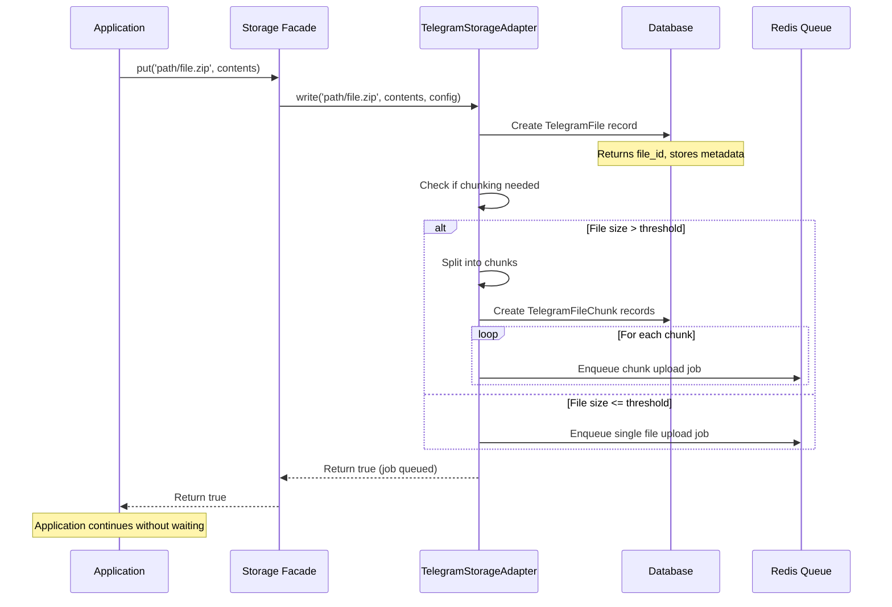
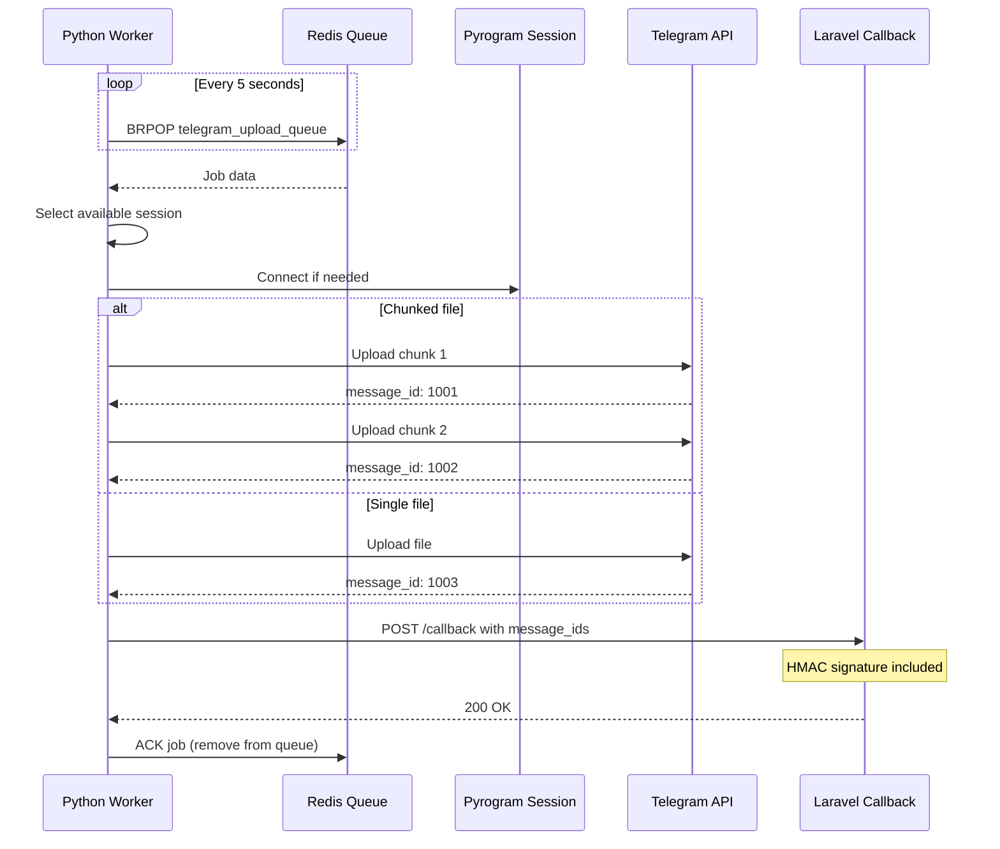
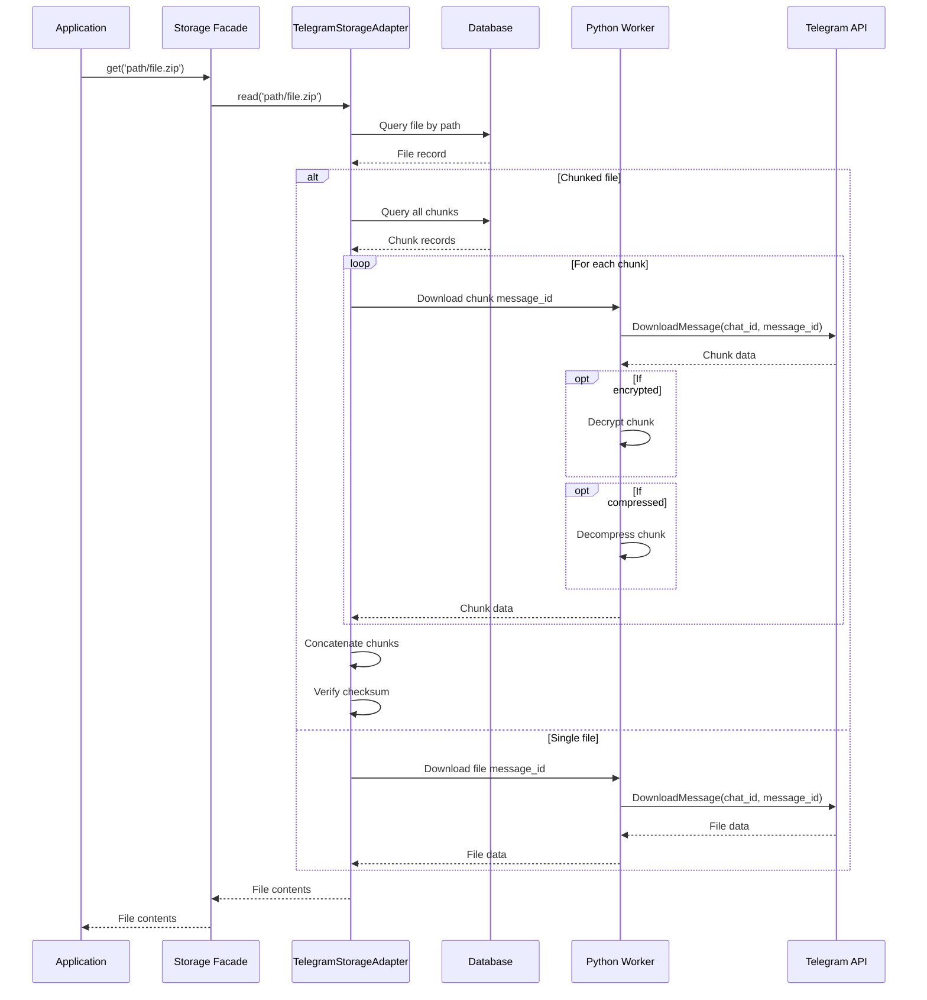
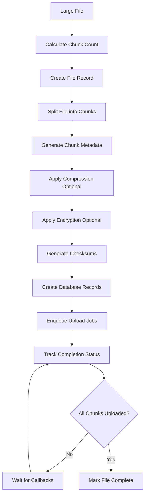
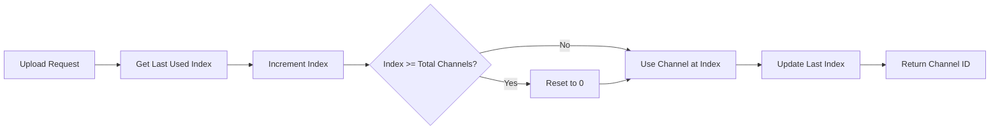
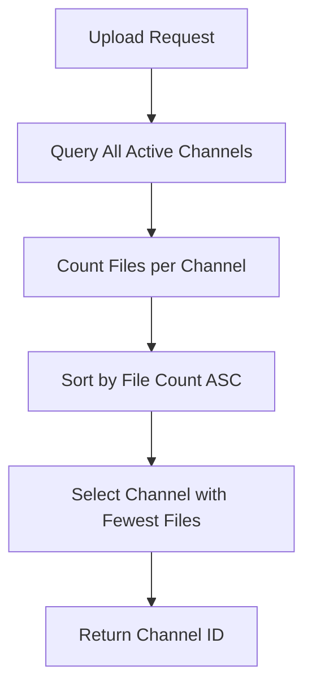
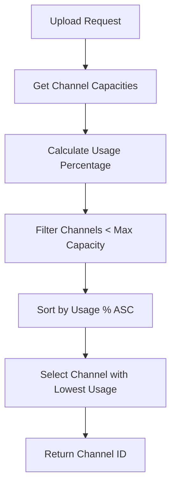
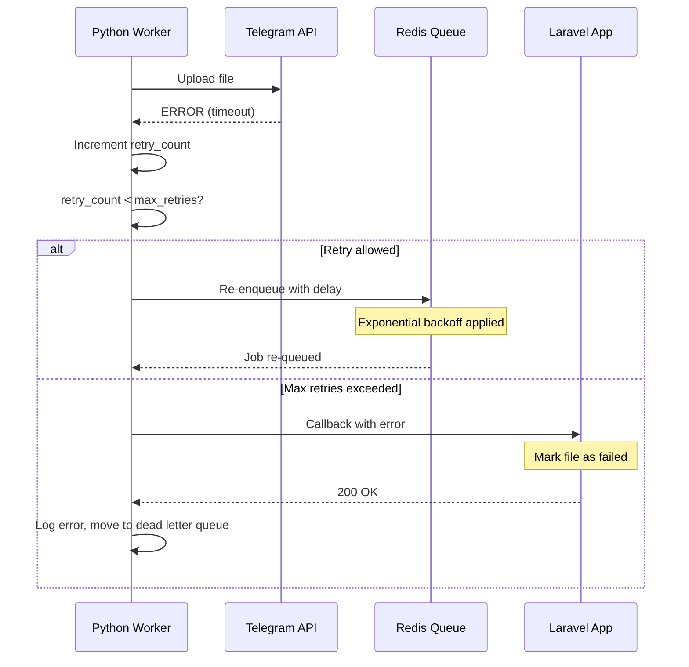
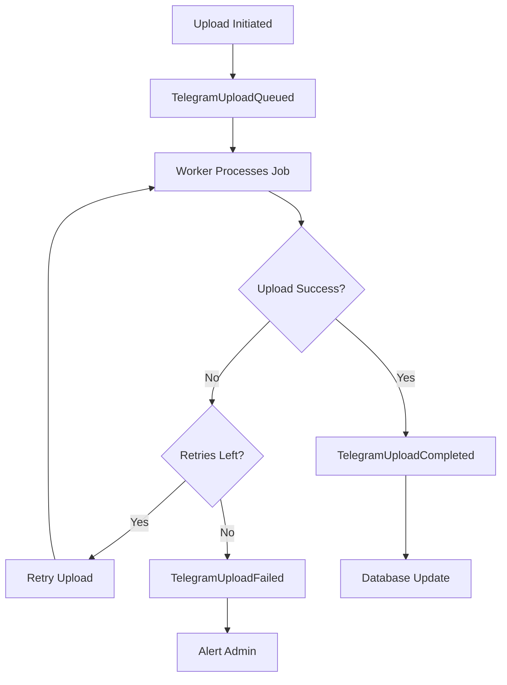

# Package Workflow Documentation

## Overview

This document provides a comprehensive explanation of how packages and modules interact within the Laravel Telegram Hybrid Storage system. The workflow encompasses the entire lifecycle from file upload to retrieval, including all intermediate processing steps.

---

## Table of Contents

1. [Package Ecosystem](#package-ecosystem)
2. [Core Modules](#core-modules)
3. [Upload Workflow](#upload-workflow)
4. [Download Workflow](#download-workflow)
5. [Chunking Workflow](#chunking-workflow)
6. [Channel Rotation Workflow](#channel-rotation-workflow)
7. [Error Handling Workflow](#error-handling-workflow)
8. [Event Flow](#event-flow)

---

## Package Ecosystem

### External Dependencies

#### PHP/Laravel Side

| Package | Purpose | Version |
|---------|---------|---------|
| `illuminate/contracts` | Laravel service contracts | ^12.0 |
| `illuminate/filesystem` | Filesystem management | ^12.0 |
| `illuminate/queue` | Queue management | ^12.0 |
| `league/flysystem` | Filesystem abstraction | ^3.0 |
| `predis/predis` | Redis client | ^2.0 |

#### Python Worker Side

| Package | Purpose | Version |
|---------|---------|---------|
| `pyrogram` | Telegram MTProto client | ^2.0 |
| `redis` | Redis client | ^4.0 |
| `aiohttp` | Async HTTP client | ^3.8 |
| `cryptography` | Encryption/decryption | ^38.0 |
| `python-dotenv` | Environment management | ^1.0 |

### Internal Packages

The system consists of two main components that work together:

1. **Laravel Package** (`shamimstack/tgsdk/laravel-telegram-hybrid-storage`)
   - Provides filesystem driver integration
   - Manages metadata and database operations
   - Handles callback processing

2. **Python Worker** (`python-worker/`)
   - Processes upload queue
   - Interfaces with Telegram API
   - Sends completion callbacks

---

## Core Modules

### Laravel Application Modules

```
┌─────────────────────────────────────────────────────────────┐
│                     Laravel Application                      │
├─────────────────────────────────────────────────────────────┤
│                                                              │
│  ┌──────────────────┐  ┌──────────────────┐                │
│  │  Storage Facade  │  │  Event System    │                │
│  │                  │  │                  │                │
│  │  - put()         │  │  - listen()      │                │
│  │  - get()         │  │  - dispatch()    │                │
│  │  - delete()      │  │  - broadcast()   │                │
│  └────────┬─────────┘  └──────────────────┘                │
│           │                                                 │
│           ▼                                                 │
│  ┌──────────────────────────────────────────────────────┐  │
│  │          TelegramStorageAdapter                       │  │
│  │                                                       │  │
│  │  Implements Flysystem FilesystemAdapter interface    │  │
│  │  - write(), read(), delete(), exists()               │  │
│  │  - Delegates to internal components                   │  │
│  └──────────────────────────────────────────────────────┘  │
│           │                                                 │
│           ├──────────┬──────────────┬──────────────┐       │
│           ▼          ▼              ▼              ▼       │
│  ┌─────────────┐ ┌──────────┐ ┌────────────┐ ┌──────────┐ │
│  │   Channel   │ │  Chunk   │ │ Integrity  │ │  Event   │ │
│  │  Rotator    │ │ Manager  │ │ Verifier   │ │Dispatcher│ │
│  └─────────────┘ └──────────┘ └────────────┘ └──────────┘ │
│                                                              │
│  ┌──────────────────┐  ┌──────────────────┐                │
│  │   Database       │  │   Redis Queue    │                │
│  │   (Eloquent ORM) │  │   (Job Queue)    │                │
│  │                  │  │                  │                │
│  │  - telegram_     │  │  - Upload jobs   │                │
│  │    channels      │  │  - Callback data │                │
│  │  - telegram_     │  │  - Status updates│                │
│  │    files         │  │                  │                │
│  │  - telegram_     │  │                  │                │
│  │    file_chunks   │  │                  │                │
│  └──────────────────┘  └──────────────────┘                │
│                                                              │
└─────────────────────────────────────────────────────────────┘
```

### Python Worker Modules

```
┌─────────────────────────────────────────────────────────────┐
│                      Python Worker                           │
├─────────────────────────────────────────────────────────────┤
│                                                              │
│  ┌──────────────────────────────────────────────────────┐  │
│  │                    worker.py                          │  │
│  │                                                       │  │
│  │  Main entry point - orchestrates all components      │  │
│  │  - Initializes session pool                           │  │
│  │  - Starts queue processor                             │  │
│  │  - Handles graceful shutdown                          │  │
│  └──────────────────────────────────────────────────────┘  │
│           │                                                 │
│           ├──────────────────┬──────────────────┐          │
│           ▼                  ▼                  ▼          │
│  ┌─────────────────┐ ┌──────────────┐ ┌─────────────────┐  │
│  │  session_pool   │ │  uploader    │ │   callback      │  │
│  │                 │ │              │ │                 │  │
│  │  - Manages      │ │  - Processes │ │  - Sends HTTP   │  │
│  │    multiple     │ │    queue     │ │    POST to     │  │
│  │    Pyrogram     │ │  - Uploads   │ │    Laravel     │  │
│  │    sessions     │ │    to        │ │  - Includes    │  │
│  │  - Connection   │ │    Telegram  │ │    signature    │  │
│  │    pooling      │ │  - Handles   │ │    verification │  │
│  │  - Rate         │ │    retries   │ │                 │  │
│  │    limiting     │ │    & errors  │ │                 │  │
│  └─────────────────┘ └──────────────┘ └─────────────────┘  │
│                                                              │
│  ┌──────────────────┐  ┌──────────────────┐                │
│  │   config.py      │  │  requirements.txt│                │
│  │                  │  │                  │                │
│  │  - Loads .env    │  │  - pyrogram      │                │
│  │  - Validates     │  │  - redis         │                │
│  │    settings      │  │  - aiohttp       │                │
│  │  - Provides      │  │  - cryptography  │                │
│  │    defaults      │  │  - python-dotenv │                │
│  └──────────────────┘  └──────────────────┘                │
│                                                              │
└─────────────────────────────────────────────────────────────┘
```

---

## Upload Workflow

### Step-by-Step Process

#### Phase 1: Application Request (Synchronous)



**Detailed Steps:**

1. **Application Call**
   ```php
   Storage::disk('telegram')->put('documents/report.pdf', $fileContents);
   ```

2. **Adapter Processing**
   ```php
   public function write($path, $contents, Config $config): void
   {
       // Calculate file size
       $size = strlen($contents);
       
       // Determine if chunking is needed
       $shouldChunk = $size > $this->chunkThreshold;
       
       // Create file record
       $file = TelegramFile::create([
           'path' => $path,
           'size' => $size,
           'mime_type' => $this->detectMimeType($contents),
           'total_chunks' => $shouldChunk ? ceil($size / $this->chunkSize) : 1,
           'checksum' => $this->integrityVerifier->generateChecksum($contents),
       ]);
       
       if ($shouldChunk) {
           // Create chunk records
           $chunks = $this->chunkManager->createChunks($file, $contents);
           
           // Enqueue each chunk
           foreach ($chunks as $chunk) {
               $this->enqueueUploadJob($chunk);
           }
       } else {
           // Enqueue single file job
           $this->enqueueUploadJob($file, $contents);
       }
       
       // Fire event
       event(new TelegramUploadQueued($file));
   }
   ```

3. **Database Record Creation**
   ```sql
   INSERT INTO telegram_files 
   (path, size, mime_type, total_chunks, checksum, status, created_at)
   VALUES 
   ('documents/report.pdf', 2500000000, 'application/pdf', 2, 'sha256_hash...', 'pending', NOW());
   ```

4. **Redis Queue Entry**
   ```json
   {
     "job_id": "550e8400-e29b-41d4-a716-446655440000",
     "file_id": 123,
     "path": "documents/report.pdf",
     "chunk_index": null,
     "channel_id": -1001234567890,
     "retry_count": 0,
     "max_retries": 3,
     "callback_url": "https://app.com/telegram-storage/callback",
     "created_at": "2024-01-01T12:00:00Z"
   }
   ```

#### Phase 2: Async Upload (Asynchronous)



**Worker Processing Code:**

```python
async def process_upload_job(job_data):
    job = json.loads(job_data)
    
    # Get session from pool
    async with session_pool.get_session() as client:
        try:
            # Download file content from temporary storage
            file_content = await download_from_temp(job['temp_path'])
            
            # Apply compression if enabled
            if job.get('compression'):
                file_content = gzip.compress(file_content)
            
            # Apply encryption if enabled
            if job.get('encryption'):
                nonce, ciphertext, tag = encrypt_chunk(
                    file_content, 
                    job['encryption_key']
                )
            
            # Upload to Telegram
            message = await client.send_file(
                chat_id=job['channel_id'],
                file=file_content,
                caption=job['caption'],
                force_document=True
            )
            
            # Send callback to Laravel
            await send_callback({
                'job_id': job['job_id'],
                'file_id': job['file_id'],
                'message_id': message.id,
                'status': 'success'
            })
            
            # Remove job from queue
            await redis.delete(f"job:{job['job_id']}")
            
        except Exception as e:
            # Handle retry logic
            if job['retry_count'] < job['max_retries']:
                job['retry_count'] += 1
                await redis.lpush('telegram_upload_queue', json.dumps(job))
            else:
                await send_callback({
                    'job_id': job['job_id'],
                    'status': 'failed',
                    'error': str(e)
                })
```

---

## Download Workflow

### Complete Download Process



**Download Implementation:**

```php
public function read($path): string
{
    // Find file in database
    $file = TelegramFile::where('path', $path)->firstOrFail();
    
    if ($file->is_chunked) {
        // Download all chunks
        $chunks = $file->chunks()->orderBy('chunk_index')->get();
        
        $contents = '';
        foreach ($chunks as $chunk) {
            $chunkData = $this->downloadFromTelegram(
                $chunk->message_id,
                $chunk->channel_id
            );
            
            // Decrypt if needed
            if ($chunk->encrypted) {
                $chunkData = $this->decryptChunk(
                    $chunkData,
                    $chunk->iv,
                    $this->encryptionKey
                );
            }
            
            // Decompress if needed
            if ($chunk->compressed) {
                $chunkData = gzdecode($chunkData);
            }
            
            $contents .= $chunkData;
        }
        
        // Verify integrity
        $checksum = $this->integrityVerifier->generateChecksum($contents);
        if ($checksum !== $file->checksum) {
            throw new IntegrityException("File checksum mismatch");
        }
        
        return $contents;
    } else {
        // Download single file
        $contents = $this->downloadFromTelegram(
            $file->message_id,
            $file->channel_id
        );
        
        // Verify integrity
        $this->integrityVerifier->verifyChecksum($contents, $file->checksum);
        
        return $contents;
    }
}
```

---

## Chunking Workflow

### When Chunking is Activated

**Threshold Configuration:**
```php
// config/telegram-storage.php
'chunk_threshold' => 1950000000, // ~1.95 GB
'chunk_size' => 1950000000,
```

**Decision Logic:**
```php
$shouldChunk = $fileSize > config('telegram-storage.chunk_threshold');
```

### Chunking Algorithm



**Chunk Structure:**

```
┌─────────────────────────────────────────────────────────┐
│                      Original File                       │
│  Size: 5.85 GB                                          │
│  Data: [AAAA...BBBB...CCCC...DDDD...EEEE...]           │
└─────────────────────────────────────────────────────────┘
                         │
                         ▼
            ┌────────────────────────────┐
            │   Split into 3 Chunks      │
            └────────────────────────────┘
                         │
        ┌────────────────┼────────────────┐
        ▼                ▼                ▼
┌──────────────┐ ┌──────────────┐ ┌──────────────┐
│   Chunk 0    │ │   Chunk 1    │ │   Chunk 2    │
│              │ │              │ │              │
│ Index: 0     │ │ Index: 1     │ │ Index: 2     │
│ Size: 1.95GB │ │ Size: 1.95GB │ │ Size: 1.95GB │
│ Data: AAAA   │ │ Data: BBBB   │ │ Data: CCCC   │
└──────────────┘ └──────────────┘ └──────────────┘
```

**Database Schema for Chunks:**

```sql
CREATE TABLE telegram_file_chunks (
    id BIGINT UNSIGNED PRIMARY KEY AUTO_INCREMENT,
    file_id BIGINT UNSIGNED NOT NULL,
    chunk_index INT NOT NULL,
    message_id BIGINT,
    channel_id BIGINT,
    size BIGINT NOT NULL,
    checksum VARCHAR(64) NOT NULL,
    iv VARCHAR(24), -- Initialization vector for encryption
    compressed BOOLEAN DEFAULT FALSE,
    encrypted BOOLEAN DEFAULT FALSE,
    status ENUM('pending', 'uploaded', 'failed') DEFAULT 'pending',
    created_at TIMESTAMP DEFAULT CURRENT_TIMESTAMP,
    updated_at TIMESTAMP DEFAULT CURRENT_TIMESTAMP ON UPDATE CURRENT_TIMESTAMP,
    
    FOREIGN KEY (file_id) REFERENCES telegram_files(id) ON DELETE CASCADE,
    INDEX idx_file_chunk (file_id, chunk_index),
    INDEX idx_status (status)
);
```

---

## Channel Rotation Workflow

### Rotation Strategies

#### 1. Round-Robin Strategy



**Implementation:**
```php
public function selectRoundRobin(): TelegramChannel
{
    $channels = $this->getActiveChannels();
    $lastIndex = cache()->get('channel_rotation_index', -1);
    $nextIndex = ($lastIndex + 1) % count($channels);
    
    cache()->set('channel_rotation_index', $nextIndex);
    
    return $channels[$nextIndex];
}
```

#### 2. Least-Used Strategy



**Implementation:**
```php
public function selectLeastUsed(): TelegramChannel
{
    return TelegramChannel::where('is_active', true)
        ->withCount('files')
        ->orderBy('files_count', 'asc')
        ->first();
}
```

#### 3. Capacity-Aware Strategy



**Implementation:**
```php
public function selectCapacityAware(): TelegramChannel
{
    return TelegramChannel::where('is_active', true)
        ->whereColumn('used_capacity', '<', 'capacity')
        ->selectRaw('*, (used_capacity / capacity) as usage_percent')
        ->orderBy('usage_percent', 'asc')
        ->first();
}
```

---

## Error Handling Workflow

### Retry Mechanism



**Retry Logic:**
```python
async def upload_with_retry(job, max_retries=3):
    for attempt in range(max_retries):
        try:
            return await upload_to_telegram(job)
        except TelegramError as e:
            if attempt == max_retries - 1:
                raise
            
            # Exponential backoff
            delay = (2 ** attempt) + random.uniform(0, 1)
            await asyncio.sleep(delay)
    
    raise MaxRetriesExceeded()
```

### Failure Scenarios

| Scenario | Detection | Recovery Action |
|----------|-----------|-----------------|
| Network timeout | Exception from Pyrogram | Retry with backoff |
| Invalid channel | Telegram API error | Mark channel inactive, rotate to next |
| File too large | Size check before upload | Split into smaller chunks |
| Checksum mismatch | Verification after download | Re-download from Telegram |
| Callback failure | HTTP error | Log and alert admin |

---

## Event Flow

### Event Lifecycle



### Event Handlers

**In Laravel EventServiceProvider:**

```php
class EventServiceProvider extends ServiceProvider
{
    protected $listen = [
        TelegramUploadQueued::class => [
            LogUploadQueued::class,
            NotifyAdmin::class,
        ],
        
        TelegramUploadCompleted::class => [
            LogUploadSuccess::class,
            UpdateCache::class,
            SendNotification::class,
        ],
        
        TelegramUploadFailed::class => [
            LogUploadFailure::class,
            AlertAdmin::class,
            CleanupPartialUploads::class,
        ],
        
        TelegramChunkCompleted::class => [
            UpdateChunkProgress::class,
        ],
    ];
}
```

**Example Listener:**

```php
class LogUploadSuccess implements ShouldQueue
{
    public function handle(TelegramUploadCompleted $event): void
    {
        Log::channel('telegram-storage')->info('File uploaded successfully', [
            'file_id' => $event->fileId,
            'path' => $event->path,
            'size' => $event->size,
            'channel_id' => $event->channelId,
            'message_id' => $event->messageId,
        ]);
    }
}
```

---

## Summary

This workflow documentation demonstrates how the various packages and modules within the Laravel Telegram Hybrid Storage system interact seamlessly to provide reliable, scalable file storage backed by Telegram channels. The architecture leverages asynchronous processing, intelligent chunking, and robust error handling to ensure high availability and data integrity.

Key takeaways:
- **Separation of concerns**: Laravel handles metadata, Python handles uploads
- **Asynchronous processing**: Non-blocking operations through queues
- **Fault tolerance**: Retry mechanisms and error recovery
- **Scalability**: Horizontal scaling through multiple workers
- **Observability**: Comprehensive event system for monitoring
